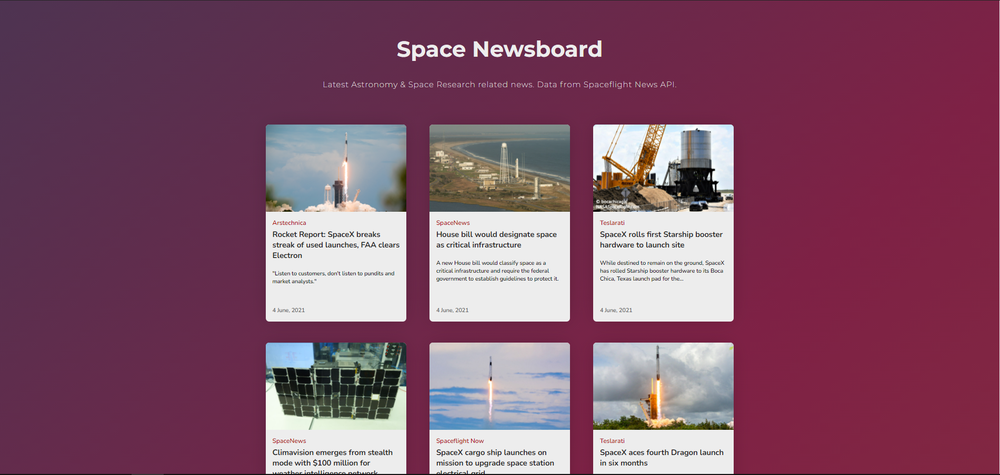

# Space Newsboard
Space Newsboard is a simple bulletin board application displaying the latest news related to astronomy and space research. This entire project was built using only vanilla JavaScript, HTML & CSS. 

Data from : https://github.com/spaceflightnewsapi/spaceflightnewsapi

 

